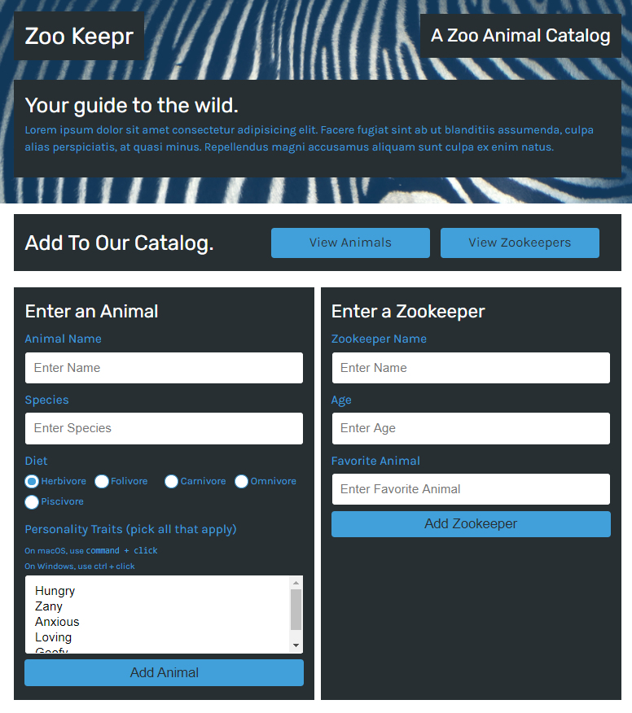

# Zookeeper
    

This is an Express.js application that will allow a user to search for and add additional animials and or zookeeprs to a mock zoo front page website.

# Installation

Clone the repository from GitHub and open using Visual Studio Code.

# Usage 

[Deployed Site](https://rst-zookeeper.herokuapp.com/)

# Credits

Made by Russ Tracy

[Express.js](https://www.npmjs.com/package/inquirer)

[Jest](https://jestjs.io/)

[Heroku](https://www.heroku.com/home)

# Questions

[Contact Me](russ_tracy@comcast.net)

[GitHub](https://github.com/russtracy)

# License
    
MIT License
    

